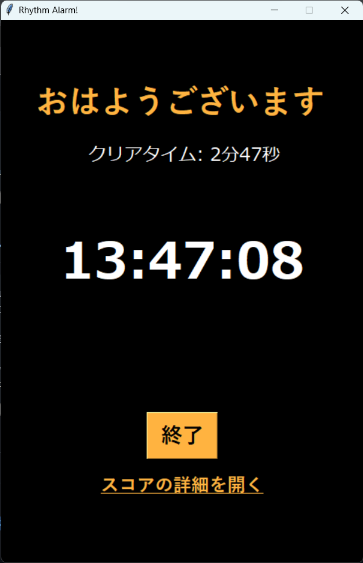

# Rhythm Alarm!
**コナミの大人気リズムゲーム "jubeat" のような、パネルクリック型のリズムゲームをクリアするまで音楽が止まらないアラームです。**  
exeファイルは [Release ページからダウンロード](https://github.com/Keisuke-Magara/Rhythm-Alarm/releases/tag/v1.0.1 "Download version1.0.1") できます。  

-------------------------------------------------

  
  

  
  

-------------------------------------------------

## 製作
**東京都市大学 2021年度 SD-PBL(2) 第2期05班**  
河西俊哉, 塩月雄也, 土岐健太郎, 眞柄圭佑, 三橋亮太

製作期間: 2021/6/23--2021/7/14

## How to Use
 0. (Mac, Linuxユーザーなど、exeファイルを使わない方のみ）
    事前に以下のライブラリを pip などでインストールしておいてください。
    ```bash
    python -m pip install -r requirements.txt
    ```
 1. ダウンロードしたフォルダ内の `Rhythm_Alarm.py` (`Rhythm_Alarm.exe`) を実行すると、 Rhythm Alarm! が起動し、アラーム画面になります。
 2. 最初に`パネルの遅延設定`をクリックし、遅延を調整してください。
 3. `測定`をクリックすると、上のパネルが動き始めるので、四角が最も大きくなった時にクリックしてください。
 4. 5回クリックすると終了し、遅延数値が反映されます。
 5. `OK`をクリックして元の画面に戻ります。
 6. 鳴動時刻とアラーム楽曲を設定して、`セット`をクリックします。
 7. 時間になると、リズムゲームがスタートします。四角が最も大きくなった時にテンポよくクリックしてください。
 8. 目標点数(初期設定は15000点)に到達すると終了です。
 9. `スコアの詳細を開く`からスコアの詳細を確認できます。
1.  `終了`をクリックして終了します。

実行時にセキュリティ警告が出ることがありますが、これは自作ソフト故署名などがされていないからだと考えられます。  
このソフトは安全ですので`許可して実行`していただければと思います。  

ダウンロードしたフォルダ内の `Score_maker.py` (Score_maker.exe) を実行すると、 Score maker for Rhythm Alarm! が起動し、使い方が表示されます。  
使い方は下の [Score maker for Rhythm Alarm!](#score-maker-for-rhythm-alarm) を参照してください。  

ディレクトリ内のファイル構成を変更すると起動しなくなる可能性があります。  
移動する際は、フォルダごと移動してください。  

以下 "Rhythm Alarm!" と "Score maker for Rhythm Alarm!" という言葉が出てきますが、exeファイルを使用する方は `Rhythm_Alarm.exe` と `score_maker.exe` 、Pythonファイルを使用する方は `Rhythm_Alarm.py` と `score_maker.py` と読み替えてください。

## 楽曲の追加と削除
楽曲の追加には、付属の Score maker for Rhythm Alarm! をお使いください。
このソフトウェアで実際にパネルをたたくことで、楽曲ファイルと譜面ファイルのassetsフォルダへのコピーと楽曲リストデータベースへの追加を自動で行います。

楽曲の削除は以下の手順で行ってください。
1. assetsフォルダ内の削除したい楽曲ファイル(ここでは`hoge.mp3`とします)と譜面ファイル(ここでは`hoge.score`とします)を削除してください
2. Rhythm Alarm! があるフォルダ(assetsフォルダの1つ上の階層)内の `music_names.txt` を編集します。
3. `music_names.txt` の1行目の数字を -1 してください 。(楽曲数を表しています) (例[元々4曲登録済みで1曲削除する場合]: 4 -> 3)
4. 削除したい楽曲名(ここでは`hoge`とします)を行ごと削除し、空白行がない状態にしてください

以上で楽曲の削除は完了です。

## Score maker for Rhythm Alarm!
このソフトウェアでは、 Rhythm Alarm! へお好みの楽曲を使って自作の譜面を作り、追加することができます。
使い方は以下の通りです。
1. 作成したい譜面の楽曲ファイルをPCに保存しておきます。
2. Score maker for Rhythm Alarm! を起動し(起動には時間がかかります)、`Open File`ボタンから楽曲ファイルを選択します。  
    既に譜面がある場合、上書きするか止めるか尋ねられます。
3. `▶️ Play`ボタンを押すと、1秒後に曲がスタートします。
4. 実際に9つのパネルをクリックして譜面を作成します。  
5. 一時停止は`STOP`ボタンでできます。
    `▶️ Play ボタン`で1秒後に再開します。
6. 同じ楽曲で複数譜面を作成したい場合は、既にある楽曲名とは別の名前でMP3ファイルを用意し、選択してください。
7. エラーにより、ファイルのコピーやデータベースへの登録が行われないことがあります。  
    その場合は[手動での楽曲ファイルの追加](#手動での楽曲ファイルの追加)を参照してください。

尚、譜面を作成中に途中で間違えてパネルをクリックしてしまった場合は最初からやり直しとなりますので気をつけてお使い下さい。

## 手動での楽曲ファイルの追加
既に譜面がある場合やエラーで登録が自動で行われなかった場合などは手作業で追加していただく必要があります。
手順は以下の通りです。 (ここでは `music` という名前の楽曲を追加します。)
1. Rhythm_Alarm! があるフォルダのassetsフォルダ内に楽曲ファイル(`music.mp3`)と譜面ファイル(`music.score`)をコピーしてください。
2. Rhythm_Alarm! があるフォルダの `music_names.txt` を開き編集します。
3. `music_names.txt` の最後の行に追加したい楽曲名(music)を書いてください。
4. `music_names.txt` の最初の行の数字を +1 してください。(楽曲数を表しています) (例[元々3曲登録済みで1曲削除する場合]: 3 -> 4)
5. `music_names.txt` 内に空白行がないことを確認して保存してください。

楽曲名は全て同じにしてください。 (例: `music.mp3`の譜面ファイルを`music.score`で作成し、`musicA`という名前で登録することはできません。)

## Pyinstallerによるexeファイル化で生じる副作用
Pyinstaller ライブラリを使用してexeファイル化する場合、以下の点に注意してください。
- exeファイル化の副作用として、パネルのGIFアニメーションの表示が速くなり、パネルの表示にずれが生じます。  
    => 以下の解決策のいずれかをお試しください。
    1. `setting.txt` の5行目の値を 14 (元のフレーム数、28fpsの半分) に設定することで改善します。
    2. パネルの遅延調整より、遅延値を調整してください。
    
- exeファイル化によって、assetsフォルダや設定ファイルなどが失われてしまうため、復元してから起動してください。  
    => assetsフォルダと `music_names.txt`, `setting.txt` , `delay.txt` を完成した `Rhythm_Alarm.exe` と同階層のディレクトリにコピーしてください。

## 成果
2021/11/5  
[第４回 都市大研究プレゼンコンテスト（4th TCU R-PresCo）](https://www.csac.tcu.ac.jp/news/2021/2021-1028-1022-12.html)にて、授業内のチームを代表して成果を発表しました。

=> [研究発表ポスターはこちら](files/TCU_R-PresCo_4th_Poster.pdf)